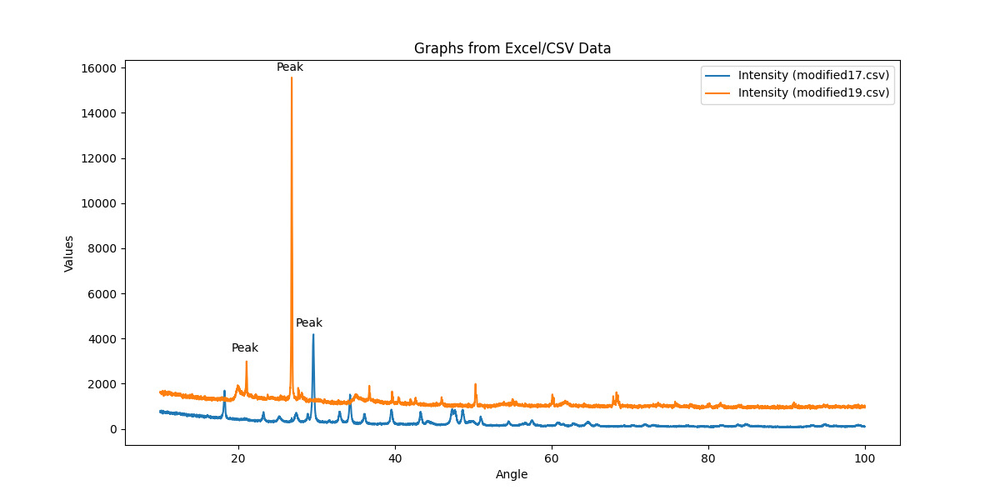

# GraphApp

GraphApp is a Python application that allows users to graph data from Excel or CSV files using a simple graphical interface. This application uses `Tkinter` for the GUI and `Matplotlib` for plotting graphs.



## Features

- Load data from Excel (`.xlsx`, `.xls`) and CSV (`.csv`) files.
- Plot multiple graphs on the same plot.
- Add custom annotations to the plot.
- Clear all graphs or reset all annotations.
- Save the plot as an image.
- Display mouse coordinates dynamically on the plot.
- Status bar to indicate the latest actions.

## Requirements

- Python 3.x
- pandas
- matplotlib
- tkinter

### Note

On some Linux workstations, you will need to install the Tkinter windowing package, system-wide using your built-in package manager.

On Arch Linux and Arch derivatives

    sudo pacman -Syu tk

## Installation

1. **Clone the repository**:
    ```bash
    git clone https://github.com/rulercosta/GraphApp.git
    cd GraphApp
    ```

2. **Create a virtual environment**:
    ```bash
    python -m venv venv
    source venv/bin/activate
    ```

3. **Install dependencies**:
    ```bash
    pip install -r requirements.txt
    ```

4. **Run the application**:
    ```bash
    python main.py
    ```

## Usage

1. **Add Graph**: Click the "Add" label to select an Excel or CSV file to add to the graph.
2. **Plot Graph**: Click the "Plot" label to display the graphs from the added files.
3. **Clear Graphs**: Click the "Clear" label to remove all graphs.
4. **Reset Annotations**: Click the "Reset" label to remove all annotations.
5. **Save Image**: Click the "Save" label to save the current plot as an image file.
6. **Add Annotation**: Click on the plot area to add an annotation at the clicked position.
7. **Status Bar**: Displays the latest action taken on the plot.

## Compiling to Windows Executable

To compile the Python script into a Windows compatible executable (`.exe`) on Arch Linux:

1. **Activate the virtual environment**:
    ```bash
    source venv/bin/activate
    ```

2. **Install PyInstaller**:
    ```bash
    pip install pyinstaller
    ```

3. **Compile the script**:
    ```bash
    pyinstaller --onefile main.py
    ```

4. **Locate the executable**: The compiled executable can be found in the `dist` directory:
    ```bash
    cd dist
    ls
    ```

5. **Test the executable**: Transfer the `.exe` file to a Windows machine and run it to ensure it works as expected.

## License

This project is licensed under the MIT License. See the [LICENSE](LICENSE) file for details.


## Contact

For questions or feedback, contact me at [rulercosta.mail@gmail.com](mailto:rulercosta.mail@gmail.com).
